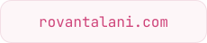
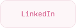

<picture>
  <source media="(max-width: 600px) and (prefers-color-scheme: dark)" srcset="assets/profile-dark-mobile.svg">
  <source media="(max-width: 600px)" srcset="assets/profile-light-mobile.svg">
  <source media="(prefers-color-scheme: dark)" srcset="assets/profile-dark.svg">
  
</picture>

<a href="https://rovantalani.com">
  <picture>
    <source media="(prefers-color-scheme: dark)" srcset="assets/website-dark.svg">
    
  </picture>
</a>
<a href="https://linkedin.com/in/rovantalani">
  <picture>
    <source media="(prefers-color-scheme: dark)" srcset="assets/linkedin-dark.svg">
    
  </picture>
</a>
